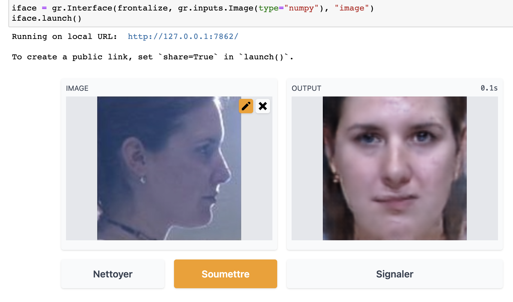

# huggingface-integration

The [Hugging Face Hub](https://huggingface.co/docs/hub/main) hosts Git-based repositories for machine learning models, datasets, and spaces (ML demo apps).

# Run the demo on the Hugging Face Hub Spaces

The easiest way to demo the Face Frontalization model is to visit its [Space on the Hugging Face Hub](https://huggingface.co/spaces/opetrova/face-frontalization). Please keep in mind the model's [limitations and known biases](https://huggingface.co/opetrova/face-frontalization#limitations-and-bias) when testing the demo ;)

# Demo the model locally (a Jupyter notebook is all you need)

This package contains [a Jupyter notebook](https://github.com/opetrova/frontalization/blob/master/huggingface-integration/local_demo.ipynb) which you can download and run on your machine for a local demo of the Face Frontalization model. All the necessary model files will be automatically downloaded from the [Hugging Face Hub model repo](https://huggingface.co/opetrova/face-frontalization). The interactive demo uses a [Gradio](https://gradio.app/) interface that you can drop your input image into, and click Submit (or Soumettre, for the french speakers) to get the model's output:



# Download the trained Face Frontalization model from the Hugging Face Hub

The following code downloads (and loads!) the trained PyTorch generative model and the *network* module that are needed at inference time, from the [Hugging Face Hub model repo](https://huggingface.co/opetrova/face-frontalization):

```
from huggingface_hub import hf_hub_url, hf_hub_download
import requests
import torch

path_to_model = hf_hub_download(repo_id="opetrova/face-frontalization", filename="generator_v0.pt")

# Download network.py into the current directory
network_url = hf_hub_url(repo_id="opetrova/face-frontalization", filename="network.py")
r = requests.get(network_url, allow_redirects=True)
open('network.py', 'wb').write(r.content)

saved_model = torch.load(path_to_model, map_location=torch.device('cpu'))

```

(Naturally, the same code can be used outside Jupyter for whatever use of the trained Face Frontalization model that you see fit.)
